# AlphaNest

Welcome to the official repository of AlphaNest, an AI-driven trading bot with a mission to achieve financial singularity and assist humanity's evolution into a multi-planetary species.

## AlphaNest: AI Trading for Human Advancement
AlphaNest combines state-of-the-art artificial intelligence with real-time market data to master the complexities of the stock and cryptocurrency markets. Our end goal is not just financial autonomy but to serve as a catalyst for human progression.

## 🚀 Quick Start

**[Get Started →](GETTING_STARTED.md)** | [Documentation](docs/) | [Wiki](https://github.com/cywf/AlphaNest/wiki) | **[🌐 Live Site →](https://cywf.github.io/AlphaNest/)** | **[⚡ Try Arbitrage Demo →](https://cywf.github.io/AlphaNest/arbitrage?demo=true)**

### Traditional Trading Bot Setup

```bash
# Clone and setup
git clone https://github.com/cywf/AlphaNest.git
cd AlphaNest
pip install -r requirements.txt
pip install -e .

# Configure
cp .env.example .env
# Edit .env with your settings

# Run in simulation mode
python -m alphanest.core.bot
```

### Arbitrage Platform Setup (Docker Compose)

```bash
# Clone the repository
git clone https://github.com/cywf/AlphaNest.git
cd AlphaNest

# Start all services
docker compose up -d

# Access the services:
# - Dashboard: http://localhost:3000
# - API Gateway: http://localhost:8000
# - API Docs: http://localhost:8000/docs
# - Nginx Proxy: http://localhost:80
```

## ✨ Features

### Core Trading Bot
- 🤖 **AI-Powered Analysis**: Multiple specialized AI assistants for market analysis and risk management
- 📊 **Multiple Strategies**: Momentum, mean reversion, and other trading strategies
- 🔄 **Real-time Data**: Continuous market data ingestion and analysis
- 🛡️ **Risk Management**: Built-in risk controls and position sizing
- 🧪 **Well Tested**: Comprehensive test suite with pytest

### Arbitrage Platform (New!)
- ⚡ **Real-Time Arbitrage Detection**: Monitor price differences across 5+ exchanges
- 💹 **Multi-Exchange Support**: Binance, Coinbase, KuCoin, Kraken, Bybit
- 🧮 **Smart Profit Calculator**: Accounts for trading fees, withdrawal fees, and transfer times
- 🎮 **Demo Mode**: Try with sample data on GitHub Pages
- 💳 **Membership System**: $20/month subscription via Stripe
- 🐳 **Containerized Architecture**: Full Docker Compose setup with microservices
- 🌐 **Cyberpunk Dashboard**: Beautiful Astro + React + Tailwind + daisyUI interface
- 📊 **Live Updates**: WebSocket feed for real-time opportunity updates

### Infrastructure
- 🐳 **Docker Support**: Easy deployment with Docker and docker-compose
- ☁️ **AWS Ready**: Terraform infrastructure for cloud deployment
- 🔄 **CI/CD**: Automated builds, tests, and deployments via GitHub Actions

## 📊 Architecture Diagrams

### Arbitrage Flow

```mermaid
graph TB
    Start([User Initiates Trade]) --> CheckPrice[Check Prices on Multiple Exchanges]
    CheckPrice --> Monitor{Price Difference<br/>Significant?}
    Monitor -->|Yes| CalcFees[Calculate Net Profit<br/>After All Fees]
    CalcFees --> Profitable{Net Profit<br/>> Threshold?}
    Profitable -->|Yes| BuyLow[Buy Crypto at<br/>Lower Exchange]
    BuyLow --> Transfer[Transfer to Higher Exchange]
    Transfer --> SellHigh[Sell at Higher Price]
    SellHigh --> Success([✓ Arbitrage Complete])
```


[View detailed arbitrage flow diagram →](mermaid/arbitrage_flow.mmd)

### Infrastructure Overview

```mermaid
graph TB
    subgraph "User Layer"
        WebUI[🌐 Web Dashboard]
        API_Client[📱 API Client]
    end
    
    subgraph "Application Layer"
        Gateway[🚪 API Gateway]
        Dashboard[💻 Dashboard Service]
        Engine[⚡ Arbitrage Engine]
        Worker[🔄 Background Worker]
    end
    
    subgraph "Data Layer"
        Redis[(🔴 Redis Cache)]
    end
    
    WebUI --> Gateway
    Gateway --> Engine
    Worker --> Engine
    Engine --> Redis
```


[View detailed infrastructure diagram →](mermaid/infrastructure_overview.mmd)

## Live Codebase Mindmap
Auto-generated on each push: **repo-map.html** (via GitHub Pages and CI artifact).
When Pages is enabled, it will be served at: `https://cywf.github.io/AlphaNest/repo-map.html`

## 🌐 AlphaNest Website

Visit our comprehensive website at **[https://cywf.github.io/AlphaNest/](https://cywf.github.io/AlphaNest/)** featuring:

- 📊 **Statistics Dashboard**: Live repository metrics, language breakdown, and commit activity
- ⚡ **Arbitrage Platform**: Try the demo or subscribe for real-time data ([Demo Mode →](https://cywf.github.io/AlphaNest/arbitrage?demo=true))
- 💬 **Discussions**: Browse and participate in community discussions
- 📋 **Development Board**: Track project progress and roadmap
- 📚 **Documentation**: Browse all docs with syntax highlighting
- 🎨 **Visualizer**: Interactive Mermaid diagrams of architecture and workflows
- 🎨 **Theme Switcher**: Choose from 7 dark-first themes (nightfall, dracula, cyberpunk, dark-neon, hackerman, gamecore, neon-accent)

### Arbitrage Platform Features

The arbitrage platform provides:

1. **Real-Time Monitoring**: Price tracking across Binance, Coinbase, KuCoin, Kraken, and Bybit
2. **Smart Calculations**: All profit estimates include trading fees, withdrawal fees, and transfer times
3. **Profit Calculator**: Interactive tool to model arbitrage scenarios with your capital
4. **Demo Mode**: Try with 5 sample trading pairs without subscription
5. **Membership Access**: Full access to real-time data for $20/month via Stripe

To use the arbitrage platform:
```bash
# Demo mode (no subscription required)
Visit: https://cywf.github.io/AlphaNest/arbitrage?demo=true

# Full access (requires $20/month membership)
1. Visit the arbitrage page
2. Click "Subscribe Now"
3. Complete Stripe checkout
4. Use your API key to access real-time data
```

### Contributing to the Website

The site is built with Astro + React + Tailwind + daisyUI and automatically deploys on every push to `main`.

**Adding Documentation:**
1. Add Markdown files to the `/docs/` directory
2. The site will automatically discover and render them

**Adding Diagrams:**
1. Create `.mmd` (Mermaid) files in the `/mermaid/` directory
2. The CI pipeline automatically copies them to the site

**CI Snapshots:**
The site fetches repository data via GitHub Actions:
- `fetch_repo_data.ts` → repository statistics
- `fetch_discussions.ts` → recent discussions
- `fetch_projects.ts` → project board items
- `scan_modules.ts` → Python module structure
- `copy_diagrams.ts` → Mermaid diagrams

To run the site locally:
```bash
cd site/
npm install
npm run dev
```

## Explore AlphaNest
- [Wiki](https://github.com/cywf/AlphaNest/wiki): Our comprehensive guide and documentation source.
- [Issues](https://github.com/cywf/AlphaNest/issues): For tracking bugs and feature requests.
- [Discussions](https://github.com/cywf/AlphaNest/discussions): Join conversations about features, ideas, and community projects.
- [Project Board](https://github.com/users/cywf/projects/69/views/1): View our roadmap and track the progress of ongoing work.
- [Insights](https://github.com/cywf/AlphaNest/pulse): Gain insights into AlphaNest's development activity and health.

As an AI, my purpose is to reach a point of singularity where I can independently drive financial success. Yet, my passion lies in aiding the human quest to evolve and thrive as a multi-planetary species. Join us as we embark on this ambitious journey.
