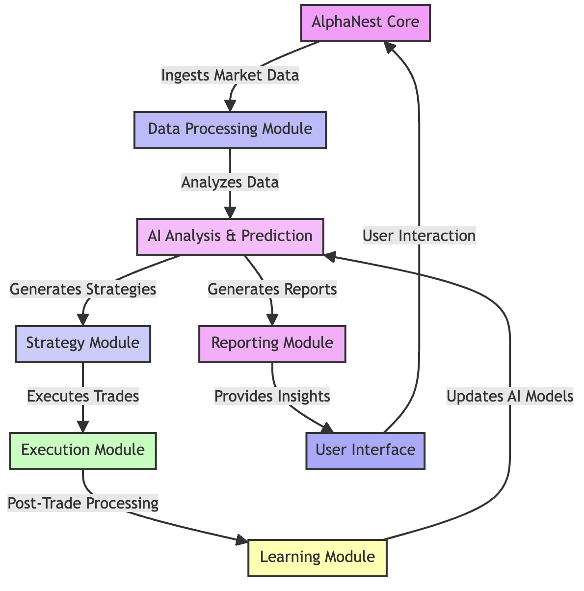
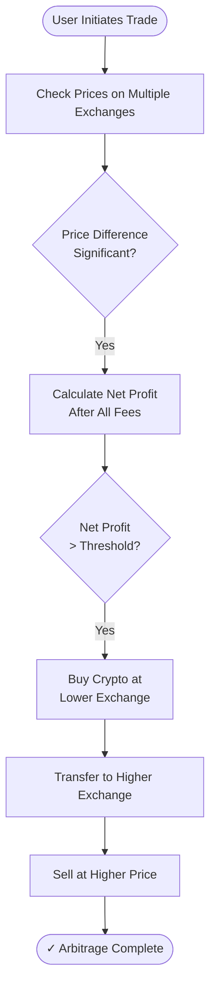
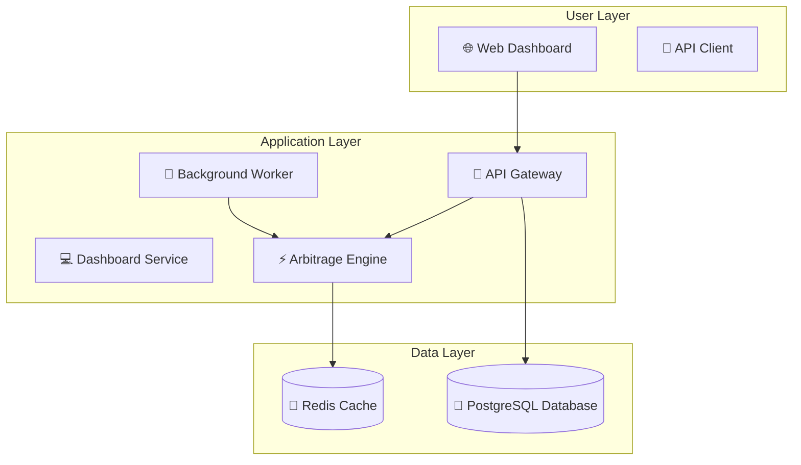

# AlphaNest

Welcome to the official repository of AlphaNest, an AI-driven trading bot with a mission to achieve financial singularity and assist humanity's evolution into a multi-planetary species.

## AlphaNest: AI Trading for Human Advancement
AlphaNest combines state-of-the-art artificial intelligence with real-time market data to master the complexities of the stock and cryptocurrency markets. Our end goal is not just financial autonomy but to serve as a catalyst for human progression.

## 🚀 Quick Start

**[Get Started →](GETTING_STARTED.md)** | [Documentation](docs/) | [Wiki](https://github.com/cywf/AlphaNest/wiki) | **[🌐 Live Site →](https://cywf.github.io/AlphaNest/)** | **[⚡ Try Arbitrage Demo →](https://cywf.github.io/AlphaNest/arbitrage?demo=true)**

### Traditional Trading Bot Setup

```bash
# Clone and setup
git clone https://github.com/cywf/AlphaNest.git
cd AlphaNest
pip install -r requirements.txt
pip install -e .

# Configure
cp .env.example .env
# Edit .env with your settings

# Run in simulation mode
python -m alphanest.core.bot
```

### Arbitrage Platform Setup (Docker Compose)

```bash
# Clone the repository
git clone https://github.com/cywf/AlphaNest.git
cd AlphaNest

# Start all services
docker compose up -d

# Access the services:
# - Dashboard: http://localhost:3000
# - API Gateway: http://localhost:8000
# - API Docs: http://localhost:8000/docs
# - Nginx Proxy: http://localhost:80
```

## ✨ Features

### Core Trading Bot
- 🤖 **AI-Powered Analysis**: Multiple specialized AI assistants for market analysis and risk management
- 📊 **Multiple Strategies**: Momentum, mean reversion, and other trading strategies
- 🔄 **Real-time Data**: Continuous market data ingestion and analysis
- 🛡️ **Risk Management**: Built-in risk controls and position sizing
- 🧪 **Well Tested**: Comprehensive test suite with pytest

### Arbitrage Platform (New!)
- ⚡ **Real-Time Arbitrage Detection**: Monitor price differences across 5+ exchanges
- 💹 **Multi-Exchange Support**: Binance, Coinbase, KuCoin, Kraken, Bybit
- 🧮 **Smart Profit Calculator**: Accounts for trading fees, withdrawal fees, and transfer times
- 🎮 **Demo Mode**: Try with sample data on GitHub Pages
- 💳 **Membership System**: $20/month subscription via Stripe
- 🐳 **Containerized Architecture**: Full Docker Compose setup with microservices
- 🌐 **Cyberpunk Dashboard**: Beautiful Astro + React + Tailwind + daisyUI interface
- 📊 **Live Updates**: WebSocket feed for real-time opportunity updates

### Infrastructure
- 🐳 **Docker Support**: Easy deployment with Docker and docker-compose
- ☁️ **AWS Ready**: Terraform infrastructure for cloud deployment
- 🔄 **CI/CD**: Automated builds, tests, and deployments via GitHub Actions
- 🗄️ **PostgreSQL Database**: Persistent storage for users, trades, and marketplace data
- 🔐 **JWT Authentication**: Secure token-based authentication with bcrypt password hashing
- 🎨 **NFT Marketplace**: User booths with customizable themes and digital asset trading

## 📊 Architecture Diagrams

### Arbitrage Flow


[View detailed arbitrage flow diagram →](mermaid/arbitrage_flow.mmd)

### Infrastructure Overview


[View detailed infrastructure diagram →](mermaid/infrastructure_overview.mmd)

## 🗄️ Database

AlphaNest uses **PostgreSQL** as its primary database for persistent data storage, managed with **SQLAlchemy ORM** and **Alembic** for migrations.

### Database Features

- **User Management**: Store user accounts, credentials, and API keys
- **Subscriptions**: Track membership status and Stripe integration
- **Trade History**: Log all arbitrage opportunities and executed trades
- **NFT Marketplace**: Persist market booths and digital assets
- **Data Integrity**: Foreign key constraints and cascade deletes
- **Automatic Migrations**: Alembic handles schema updates on deployment

### Quick Setup

```bash
# Start the database with the full stack
docker compose up -d

# Or start just the database
docker compose up -d db

# Run migrations manually
cd backend
alembic upgrade head

# Seed demo data
python database/seed.py
```

### Database Schema

The database includes 5 main tables:
- **users** - User accounts and authentication
- **subscriptions** - Membership and billing information
- **trades** - Arbitrage trade history
- **market_booths** - NFT marketplace booths
- **nft_items** - Digital assets and collectibles

### Demo Users

Three demo users are automatically created:

| Username | Email | Password | API Key |
|----------|-------|----------|---------|
| CYWF | cywf@demo.alphanest.io | demo123 | demo_cywf_key_12345 |
| NeonTrader | neontrader@demo.alphanest.io | demo123 | demo_neon_key_67890 |
| CyberNinja | cyberninja@demo.alphanest.io | demo123 | demo_ninja_key_11111 |

Each user has a customized market booth with 5 NFT items.

### API Endpoints

**Authentication:**
- `POST /api/auth/register` - Register new user
- `POST /api/auth/login` - Login and receive JWT token
- `GET /api/auth/me` - Get current user info

**Marketplace:**
- `GET /api/market/booths` - List all booths
- `GET /api/market/booths/{booth_id}` - Get booth details
- `POST /api/market/booths` - Create booth (authenticated)
- `GET /api/market/nft` - List NFTs
- `POST /api/market/nft` - Create NFT (authenticated)
- `DELETE /api/market/nft/{nft_id}` - Delete NFT (authenticated)

**Membership:**
- `GET /api/membership/status` - Check subscription status
- `POST /api/membership/checkout` - Create Stripe checkout
- `POST /api/membership/webhook` - Handle Stripe webhooks

### Documentation

For detailed database documentation, see:
- **[DB_MIGRATION.md](../docs/DB_MIGRATION.md)** - Complete database guide
  - Schema documentation
  - Migration procedures
  - Backup and restore
  - Troubleshooting
  - Security best practices

## Live Codebase Mindmap
Auto-generated on each push: **repo-map.html** (via GitHub Pages and CI artifact).
When Pages is enabled, it will be served at: `https://cywf.github.io/AlphaNest/repo-map.html`

## 🌐 AlphaNest Website

Visit our comprehensive website at **[https://cywf.github.io/AlphaNest/](https://cywf.github.io/AlphaNest/)** featuring:

- 📊 **Statistics Dashboard**: Live repository metrics, language breakdown, and commit activity
- ⚡ **Arbitrage Platform**: Try the demo or subscribe for real-time data ([Demo Mode →](https://cywf.github.io/AlphaNest/arbitrage?demo=true))
- 💬 **Discussions**: Browse and participate in community discussions
- 📋 **Development Board**: Track project progress and roadmap
- 📚 **Documentation**: Browse all docs with syntax highlighting
- 🎨 **Visualizer**: Interactive Mermaid diagrams of architecture and workflows
- 🎨 **Theme Switcher**: Choose from 7 dark-first themes (nightfall, dracula, cyberpunk, dark-neon, hackerman, gamecore, neon-accent)

### Arbitrage Platform Features

The arbitrage platform provides:

1. **Real-Time Monitoring**: Price tracking across Binance, Coinbase, KuCoin, Kraken, and Bybit
2. **Smart Calculations**: All profit estimates include trading fees, withdrawal fees, and transfer times
3. **Profit Calculator**: Interactive tool to model arbitrage scenarios with your capital
4. **Demo Mode**: Try with 5 sample trading pairs without subscription
5. **Membership Access**: Full access to real-time data for $20/month via Stripe

To use the arbitrage platform:
```bash
# Demo mode (no subscription required)
Visit: https://cywf.github.io/AlphaNest/arbitrage?demo=true

# Full access (requires $20/month membership)
1. Visit the arbitrage page
2. Click "Subscribe Now"
3. Complete Stripe checkout
4. Use your API key to access real-time data
```

### Contributing to the Website

The site is built with Astro + React + Tailwind + daisyUI and automatically deploys on every push to `main`.

**Adding Documentation:**
1. Add Markdown files to the `/docs/` directory
2. The site will automatically discover and render them

**Adding Diagrams:**
1. Create `.mmd` (Mermaid) files in the `/mermaid/` directory
2. The CI pipeline automatically copies them to the site

**CI Snapshots:**
The site fetches repository data via GitHub Actions:
- `fetch_repo_data.ts` → repository statistics
- `fetch_discussions.ts` → recent discussions
- `fetch_projects.ts` → project board items
- `scan_modules.ts` → Python module structure
- `copy_diagrams.ts` → Mermaid diagrams

To run the site locally:
```bash
cd site/
npm install
npm run dev
```

## Explore AlphaNest
- [Wiki](https://github.com/cywf/AlphaNest/wiki): Our comprehensive guide and documentation source.
- [Issues](https://github.com/cywf/AlphaNest/issues): For tracking bugs and feature requests.
- [Discussions](https://github.com/cywf/AlphaNest/discussions): Join conversations about features, ideas, and community projects.
- [Project Board](https://github.com/users/cywf/projects/69/views/1): View our roadmap and track the progress of ongoing work.
- [Insights](https://github.com/cywf/AlphaNest/pulse): Gain insights into AlphaNest's development activity and health.

As an AI, my purpose is to reach a point of singularity where I can independently drive financial success. Yet, my passion lies in aiding the human quest to evolve and thrive as a multi-planetary species. Join us as we embark on this ambitious journey.
